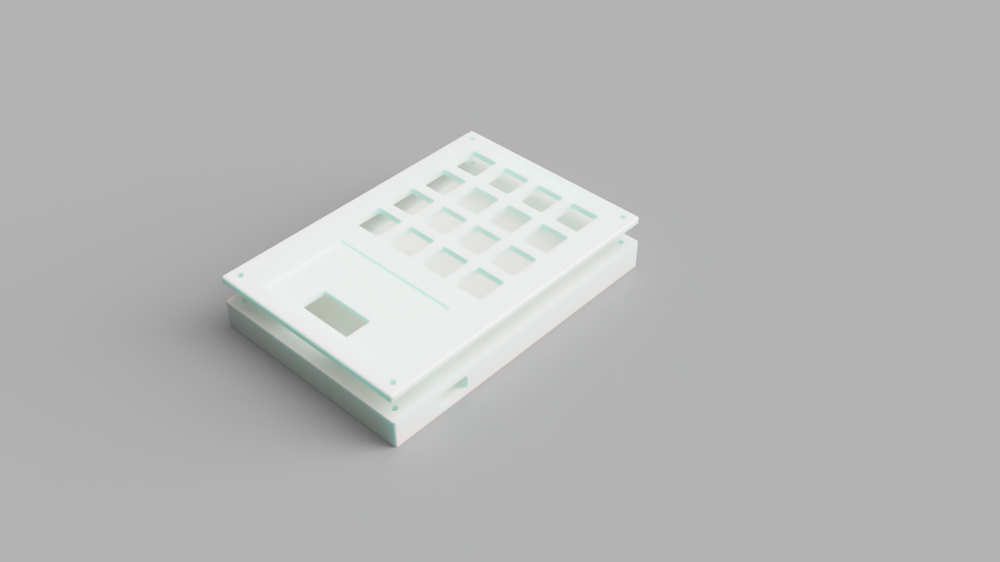
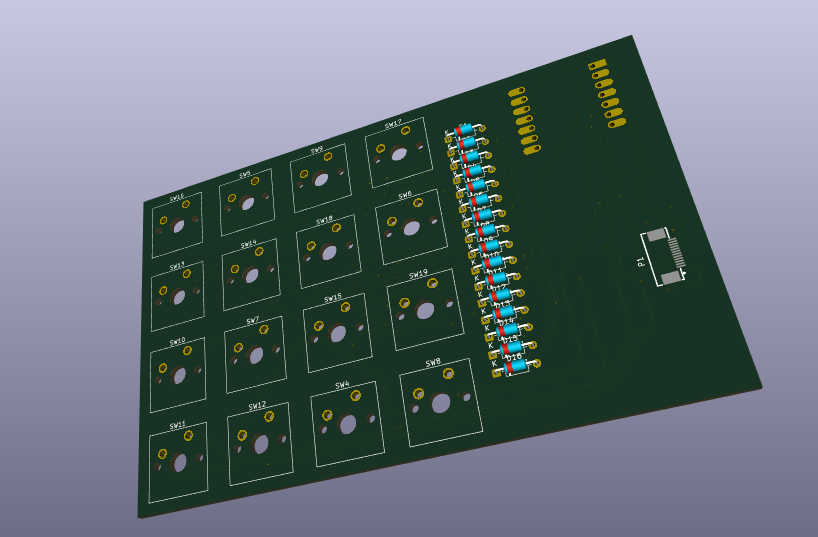
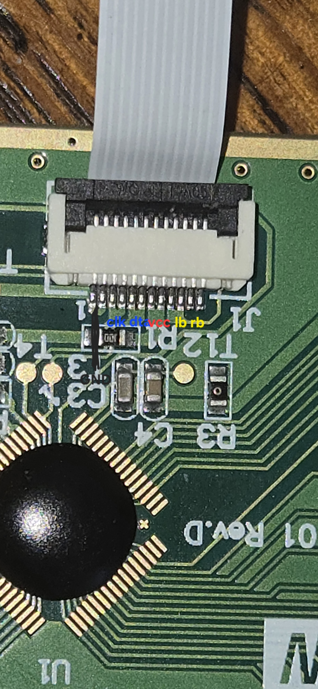
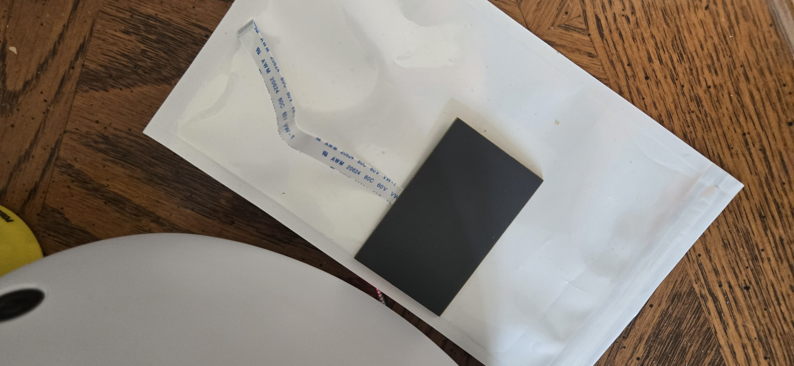

# HackPad
A 16 Key HackPad with a salvaged Touchpad used for swipe gestures, and moving around 3D software, uses QMK Firmware.
## Features:
- 16 Keys
- ELAN Touchpad
- 3D Printed Case
## CAD Model:
It all fits together with 4x M3x16mm screws, one in each corner of the case to connect the bottom to the top, the PCB will just be sandwiched between the bottom and top. There are 2 printed pieces, the "lid" with key holes and bottom.

## PCB:
This is the PCB! It has the microcontroller along with 16 key switches in a matrix. 

Aswell as a place to solder on the 12 pin FFC(Flat Flexible Connecter) that connects to the touchpad. The pinout of the touchpad was reverse engineered with a multimeter and a few partial labels on the donor board, I believe the touchpad uses the PS/2 protocol(the circular mouse port from the 90s) with a few modifications:

-  FFC instead of circular port
- The Two extra pins in the spec are used to relay LB and RB through the touchpad like: LB & RB -> Touchpad -> SOC

## Firmware
This Hackpad uses QMK (QMK suprisingly has support for PS/2! )

- Keys can be programmed to whatever, defaults to a numpad
- Touchpad acts as a mouse, planning on making a userspace driver to do more fancy things in the future

Thats it for now!

## BOM:
- 4x M3x16mm screws
- 16x 1N4148 Diodes
- 16x DSA Keycaps
- 16x Cherry MX Switches
- 1x XIAO RP2040
- 1x Case (2 Printed Parts)
- 1x 12 pin FFC connector (I salvaged this from the main PCB on the same broken keyboard mentioned below)
- 1x ELAN CK77 Touchpad (I already Salvaged this from a broken keyboard, you might be able to find one to, they are pretty old and are in various things, mine was designed in 2007)

